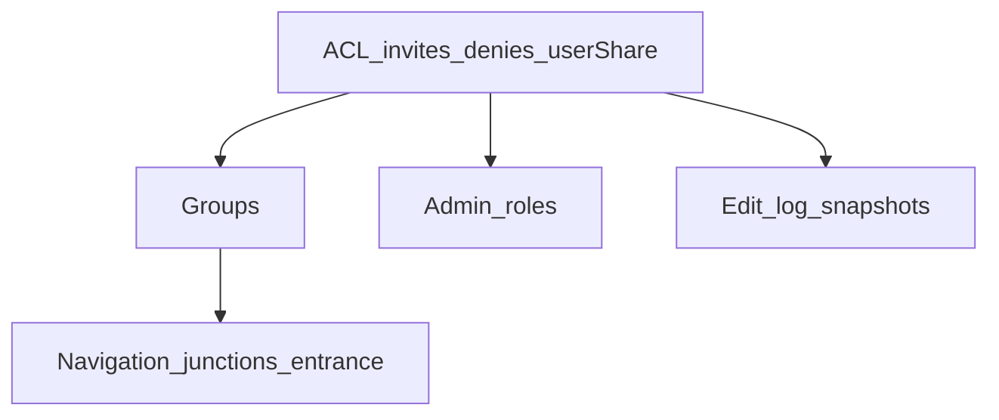

# Proseden outstanding features

Implement the deferred Proseden features in dependency order: richer ACLs (invite/deny/user-level share), groups, navigation (exit go, junctions, entrance groups, teleport), admin roles, then edit logging with optional snapshots — all still file-backed and in-memory.

## Already done (v1)

- Scenes `/s/:id`, artefacts `/a/:id`, details as query keys, HTML + text
- Auth (cookie + bearer), public/private, owner edit, collect/inventory
- Exit records with `exitId` + `nickname` (linked by destination id only)
- Schema hooks: `invites`, `denies`, `groupId`, `entranceGroupId`, user `grants`/`denies`
- Access helpers with deny → grant → public/owner order (`src/access/permissions.ts`)

## Outstanding (from SPEC + deferred README list)

| Area | Spec need |
|---|---|
| ACL | Invite read/edit/manage; deny overrides; user-level share-all; optional public invite |
| Groups | Non-nested; rights on group; scene in at most one group |
| Navigation | Go by exit id/nickname; teleport by scene id; public junctions; entrance groups |
| Roles | Moderator / Topographer / Manager |
| History | Edit log always; retain/view some snapshots |
| Polish | Artefact move (API exists; expose clearly in UI); delete exits/scenes |

Verb-noun adventure parser stays out of scope: HTTP remains the interaction model.

## Concrete ACL model (replaces string-only invites)

Expand grants beyond “username list = read”:

```ts
type Right = "read" | "edit" | "manage";
type Grant = { who: string | "*"; rights: Right[] }; // "*" = everyone (still subject to deny)
type Deny = { who: string; rights?: Right[] };       // omit rights = deny all
```

- Persist on **scene**, **group**, and **user** (user-level = share all that user’s scenes/groups).
- Migrate existing `invites: string[]` → `grants: [{ who, rights: ["read"] }]`.
- Evaluation (single function, already sketched): deny (user→group→scene) → grants (scene → group → user-level) → public → owner → roles.
- `manage` includes edit + invite/deny on that object; owner always has manage.
- Wire `canEdit` / new `canManage` through grants (today edit is owner-only).

APIs (auth required for mutations):

- `GET/PUT /s/:id/access`, `GET/PUT /u/:username/access` (owner or manage)
- Same for groups once they exist
- Sidebar: grant/deny lists; share-all on `/profile`

## Implementation phases



### Phase 2 — Permissions UI + API ✅

- Types + migration in `src/model/types.ts` / load path in `src/store/world.ts`
- Finish `src/access/permissions.ts`: rights levels, `*`, user-level grants, group stub no-op until Phase 3
- Routes + HTML sidebar panels for scene access; text mode shows access summary only to managers
- Seed: keep Threshold public; Private Study demonstrates invite (visitor read grant)

### Phase 3 — Groups ✅

- On disk: `data/groups/<id>.json` `{ id, owner, title, sceneIds[], grants, denies, createdAt }`
- Scene `groupId` set exclusively (clear old group membership on move)
- Group rights feed `canRead` / `canEdit` / `canManage`
- APIs: `POST /g`, `GET/PUT /g/:id`, `POST /g/:id/scenes`, access endpoints
- Sidebar: assign/remove current scene’s group (owner/manage); group ACL on `/g/:id`

### Phase 4 — Navigation ✅

- **Go:** `GET /s/:id/go/:exit` where `:exit` is numeric `exitId` or nickname → redirect to destination (access-checked)
- **Teleport:** `GET /s/:id` already is teleport; add HTML/text “Travel to id” control; resolve **entrance groups**: if requester is outside the group, redirect to the group’s entrance scene (still require `canRead` on entrance; deny if entrance unreadable)
- On disk: `data/entrance-groups/<id>.json` `{ id, title, entranceSceneId, sceneIds[] }`; scene `entranceGroupId`
- **Public junctions:** `isJunction: true` on a public scene; any signed-in writer may `POST` an exit *from* that junction. Non-junction scenes: only managers of the from-scene (or topographers) add exits. Destination must be readable (public scenes are always linkable as destinations).
- List exits in text/HTML with go URLs (`/s/1/go/2`, `/s/1/go/reading%20nook`)

### Phase 5 — Admin roles ✅

- `data/staff.json` (or per-user `roles[]`): `moderator` | `topographer` | `manager`
- **Moderator:** edit/delete any scene/artefact prose (not necessarily restructure graph)
- **Topographer:** edit exits, groups, junctions, entrance groups worldwide (not prose)
- **Manager:** assign roles + user denies at staff level (superset of moderator + topographer)
- Bootstrap: first manager via env `PROSEDEN_MANAGERS=gardener` or seed staff file
- Access helpers consult roles after ownership/grants

### Phase 6 — Version history ✅

- On each scene/artefact save: append to `scenes/<id>.edits.jsonl` (or `.log.json`) `{ at, by, fields }`
- Retain snapshot when: explicit “keep version” checkbox, or body hash changed and `retainSnapshot: true` in request; store under `scenes/<id>.versions/<iso>.md`
- `GET /s/:id/history` (text/HTML list); `GET /s/:id/history/:version` view snapshot (read requires same as scene read; restore requires manage)
- Edges remain unversioned (creation date only), per spec

## Cross-cutting

- Keep single-process file write-through + atomic renames
- HTML sidebar sections grow per phase; text/curl stay first-class
- Update `SPEC.md` / `README.md` as each phase lands
- No new database; groups/entrance-groups/staff/history are additional files under `data/`

## Suggested build order for PRs

1. ACL model + scene/user access API + sidebar (Phase 2)
2. Groups (Phase 3)
3. Go routes + junctions + entrance teleport (Phase 4)
4. Staff roles (Phase 5)
5. Edit log + snapshots (Phase 6)

## Out of scope

- Nested groups, chat, presence, search, WYSIWYG, multi-process writers, content filters
- Verb-noun adventure parser (HTTP remains the interaction model)
- Adventure parser / mission journal — see [PUZZLES.md](PUZZLES.md) for quests, flags, gated prose, and artefact alchemy (not a full IF runtime)
