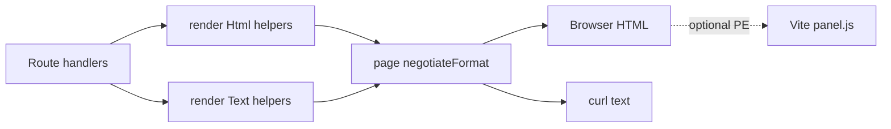
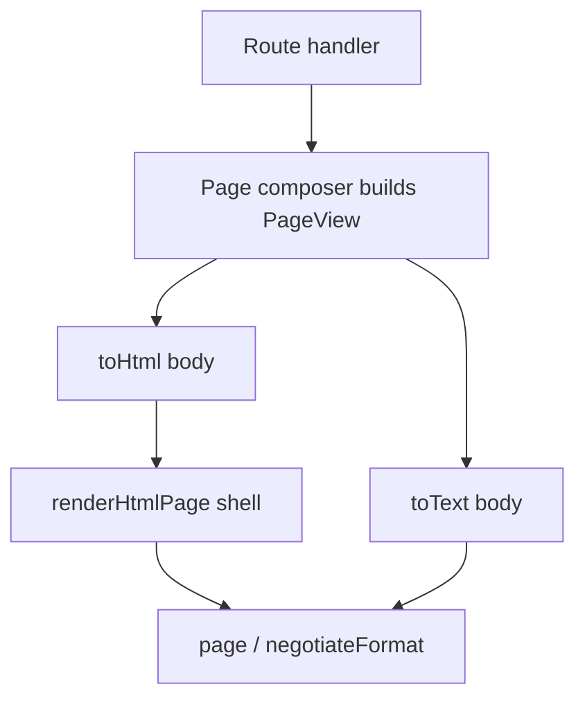
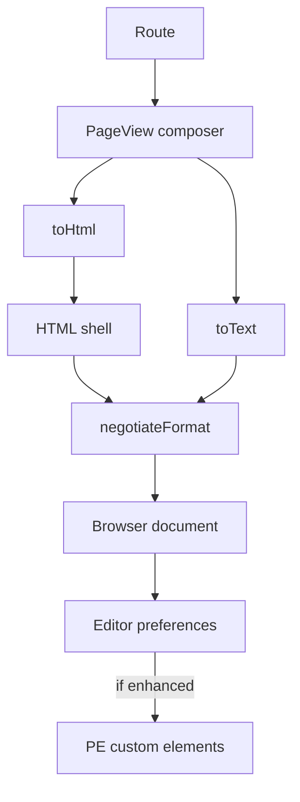

# Rendering reuse and layout engine

Decision record for how Proseden builds HTML and text responses, and how optional client editors may upgrade form controls.

**Status:** implemented (document model + preference-gated editors)  
**Related:** [SPEC.md](SPEC.md), [LIVE.md](LIVE.md), [NAVIGATION.md](NAVIGATION.md)

---

## Verdict

- **Do not** adopt React, Vue, Svelte, or another SPA/UI framework.
- **Do** keep server-built documents (SSR): Hono builds the response; the browser receives finished HTML or plain text.
- **Do** introduce a thin **document model → dual renderers** layout engine so each page builds structure once, and HTML/text are serializers — not parallel string concatenation.
- **Do** use a small set of light-DOM custom elements for **optional** richer editors, gated by **user preference** (not merely “JS is available”).
- Curl/text meaning and no-JS HTML remain first-class.

---

## What we have today

Proseden is intentionally:

- Hono + TypeScript SSR via string builders in `src/render/html.ts` and `src/render/text.ts`
- Format negotiation so curl gets text (`src/render/format.ts`)
- Progressive enhancement for Live/Edit (`LIVE.md`, `client/panel.ts`) — without JavaScript, HTML stays hyperlinked text
- No template engine and no UI framework — reuse is function-level

That architecture is coherent. The friction is not “missing React”; it is:

1. **Dual-channel duplication** — almost every page has twin `render*Html` / `render*Text` functions that restate the same structure.
2. **String concatenation as composition** — page bodies interpolate helpers into large template literals; structure lives only in the finished string.
3. **Three surfaces** — HTML strings, text strings, and client DOM builders (`client/edit.ts`) drift apart (e.g. `jsonField` + JSON examples).



### Already reusable (keep)

| Concern | Where | Status |
|---|---|---|
| Prose adornments | `src/render/prose.ts` `formatProse` | Centralized; HTML-only by design |
| Username links | `userLinkHtml` / `userPath` | Good; inbox sender still plain text |
| Page back crumb | `renderPageBackCrumb` + `sceneBackLink` | Good; many crumbs still hand-rolled |
| Collapsibles | Native `<details>` / `<summary>` | Correct default; no WC needed |
| JSON textarea prep | `src/json-textarea.ts` | Shared logic; UI markup still duplicated |

### Real pain points

- `jsonField` / examples duplicated between `src/render/html.ts` and `client/edit.ts`
- Labeled fields / body textareas repeated in the Edit panel
- Ad-hoc crumbs beside `renderPageBackCrumb`
- Small utilities copied (`el()`, `escapeAttr`, `entityKindLabel`, JSON example blobs)
- Incomplete text twins (e.g. group detail falling back to a generic message)

---

## Why not a component framework

| Approach | Fit for Proseden |
|---|---|
| React / Vue / Svelte | Fights curl-first dual channel; heavy |
| Lit / Stencil as *the* UI system | Useful for a few PE widgets; overkill as the sole page builder |
| Full Shadow DOM design system | Hurts plain-document HTML, shared CSS, basic browsers |
| Keep only giant `html.ts` forever | Works, but dual-channel reuse stays accidental |

Constraints (text twin, meaningful HTML without JS, subdirectory-relative assets) favor **document HTML + optional JS**, not framework-owned trees.

---

## Layer A — Document model and layout engine

### Problem with “helpers that return strings”

Layer A as “more string helpers” is necessary but incomplete. Helpers reduce duplication of *fragments*, but each page still **concatenates** HTML and, separately, **rebuilds** the same outline as text. Structure is not a value you can inspect, test, or serialize twice.

### Recommendation: build a view tree, then render

Adopt a small **Proseden document vocabulary** — a discriminated union of nodes — and two pure serializers:

```ts
// Conceptual sketch — not final API
type Node =
  | { type: "heading"; level: 1 | 2 | 3; text: string; sub?: string }
  | { type: "crumb"; href: string; label: string; history?: boolean }
  | { type: "byline"; username: string }
  | { type: "prose"; text: string }          // formatProse in HTML; raw in text
  | { type: "linkList"; items: { href: string; label: string; note?: string }[] }
  | { type: "section"; title: string; children: Node[] }
  | { type: "details"; summary: string; open?: boolean; children: Node[] }
  | { type: "notice"; text: string }
  | { type: "para"; text: string; class?: string }
  | { type: "userLink"; username: string }
  | { type: "form"; method?: string; action: string; class?: string; children: Node[] }
  | { type: "field"; label: string; control: Control }
  | { type: "actions"; children: Node[] }    // button rows, POST recipes in text
  // …only as many control types as we actually need

type Control =
  | { type: "text"; name: string; value?: string; attrs?: Record<string, string> }
  | { type: "password"; name: string; attrs?: Record<string, string> }
  | {
      type: "textarea";
      name: string;
      value: string;
      rows?: number;
      /** Marker for optional client upgrade — ignored by text renderer */
      editor?: "plain" | "prose" | "json";
      jsonExample?: string;
      jsonHelp?: string;
    }
  | { type: "button"; label: string; attrs?: Record<string, string> };

type PageView = {
  title: string;
  body: Node[];
  // shell inputs stay beside the view (manage bootstrap, live scene, …)
};
```



**Page composers** (today’s `renderSceneBodyHtml` + `renderSceneText`) become one function: `scenePageView(…).body`. **Renderers** own escaping, `formatProse`, crumb markup, text indentation, and curl action recipes.

Longer term, `page()` can accept a `PageView` (or body nodes + title) and pick the serializer from `negotiateFormat`, so routes stop threading parallel strings.

### Design rules for the engine

1. **Vocabulary, not HTML AST** — nodes are Proseden UI ideas (`crumb`, `prose`, `linkList`), not `div`/`span`. Prefer extending the union over a `rawHtml` escape hatch; allow a rare `unsafeHtml` only during migration.
2. **Two serializers, one meaning** — HTML and text may differ in affordance (links vs paths, forms vs `POST` recipes) but must present the same *content and available actions*.
3. **Escape only at the edge** — composers pass plain strings; `toHtml` escapes; `toText` does not invent markup.
4. **Forms are first-class but finite** — model the controls we use (profile, msg, access, edit panel descriptors), not a general form builder.
5. **No JSX / no template language** — plain TypeScript factories (`crumb(…)`, `prose(…)`) keep the stack boring and grep-friendly.
6. **Shell stays separate** — document chrome (`renderHtmlPage`, auth header, `#edit-root`, bootstrap JSON) is not part of every page body tree.
7. **Incremental migration** — add `src/render/view/` (nodes + factories + `toHtml` / `toText`); migrate scene/artefact/profile first; leave route-local admin HTML until the vocabulary covers it.

### Why this beats “only more string helpers”

| | String helpers only | Document model + serializers |
|---|---|---|
| Dual HTML/text | Still twin page functions | One composer |
| Reuse | Fragment-level | Structure-level |
| Tests | Snapshot giant strings | Assert node trees + golden HTML/text |
| Editor markers | Ad-hoc `data-*` in strings | `textarea.editor` on the model |
| Risk | Low | Medium upfront, lower ongoing drift |

**This is still Layer A** — server presentation — not web components. WCs do not replace the need for a dual-channel document model.

### What we will not build

- A general HTML templating language (Handlebars, JSX runtime, lit-html on the server)
- Shadow DOM or client-only primary page bodies
- A third “JSON page” serializer unless/until API needs mirror the same vocabulary (out of scope for now)

---

## Layer B — Preference-gated editor upgrades

Plain `<textarea>` remains the **baseline** everywhere (SSR forms, Edit panel, no-JS, curl recipes).

Richer editors are **progressive enhancements** that replace or wrap those controls in the DOM **only when**:

1. JavaScript runs, **and**
2. The user has opted into that enhancement.

Even with JS enabled, a user may prefer old-school JSON/prose editing. Capability alone must not force the upgrade.

### Preference model

- Keys (illustrative): `proseden-editor-prose` = `plain` \| `enhanced`; `proseden-editor-json` = `plain` \| `enhanced`
- Storage: `localStorage` for immediate UX (same spirit as `proseden-panel`); optional later sync to profile if we want cross-device defaults
- **Default: `plain`** — matches “hyperlinked text first” and respects users who want raw control
- UI: small control in Edit panel and/or profile (“Enhanced prose editor”, “Enhanced JSON editor”)

### Technical shape

- Server/`PageView` always emits ordinary textareas, tagged for upgrade (`editor: "prose" | "json"` → `data-editor="prose"` or a light-DOM wrapper)
- Client registers a tiny PE module; on load it reads preferences and upgrades matching controls
- Turning preference off restores plain textarea behavior (same field `name` / value)
- Submit payload stays plain stored prose / JSON text — no new storage format
- Prefer **light DOM** (no Shadow DOM) so `client/styles.css` and basic browsers keep working
- Do **not** adopt CodeMirror/ProseMirror/Quill unless a thin toolbar proves insufficient

### Highest-value upgrades

1. **Prose** — toolbar/shortcuts for Proseden adornments (`_em_`, `*bold*`, links, headings) matching `formatProse`
2. **JSON** — validate/format on blur; keep the existing “i” help `<details>`; reuse `formatJsonTextarea` / `prepareJsonTextarea`

Do **not** turn crumbs, username links, or prose *output* into custom elements. Those stay ordinary HTML from `toHtml`.

---

## Target architecture



---

## Implementation sequence

1. **Document model skeleton** — node types, factories, `toHtml` / `toText` for the core vocabulary (heading, crumb, byline, prose, linkList, section, details, notice, para, userLink).
2. **Migrate one vertical** — scene page (and ideally artefact) to `PageView`; delete the twin string composers for that page once golden tests match.
3. **Form controls in the model** — field/textarea/json help; unify JSON examples in one module; profile + msg as second migration wave.
4. **Normalize leftovers** — inbox `fromUser` links, hand-rolled crumbs, shared `escapeAttr` / `entityKindLabel`.
5. **Wire `page()` to views** (optional polish) — accept body nodes or `PageView` so routes stop passing parallel strings.
6. **Layer B** — tag textareas from the model; preference UI; prose then JSON enhancers (default off).
7. **Edit panel alignment** — client builds the same control markers (or consumes shared descriptors) so PE preferences apply in the sidebar too.

---

## Direct answers

| Question | Answer |
|---|---|
| SSR? | Yes — server-built HTML/text documents. Keep it. |
| Component framework? | No. |
| Own web components? | Only for preference-gated editor PE (Layer B). |
| Own layout engine? | **Yes** — thin document model + `toHtml` / `toText`, not a general template language. |
| String helpers alone? | Useful fragments, but insufficient for dual-channel structure. |
| Curl / basic HTML? | Unchanged in meaning if serializers share one view and PE only upgrades tagged controls when preferred. |

**Bottom line:** Compose **page views** once; **serialize** to HTML and text; **optionally enhance** editors when the user asks for it.

---

## Implemented layout

| Piece | Location |
|---|---|
| Node vocabulary + `PageView` | `src/render/view/types.ts` |
| Factories | `src/render/view/factories.ts` |
| `toHtml` / `toText` | `src/render/view/toHtml.ts`, `toText.ts` |
| Page composers | `src/render/view/pages/` (scene, artefact, profile, msg, inbox) |
| `page(c, status, view)` | `src/http.ts` |
| Shared JSON examples | `src/render/view/examples.ts` |
| Editor PE + prefs | `client/editors.ts` (`proseden-editor-prose` / `proseden-editor-json`, default plain) |
